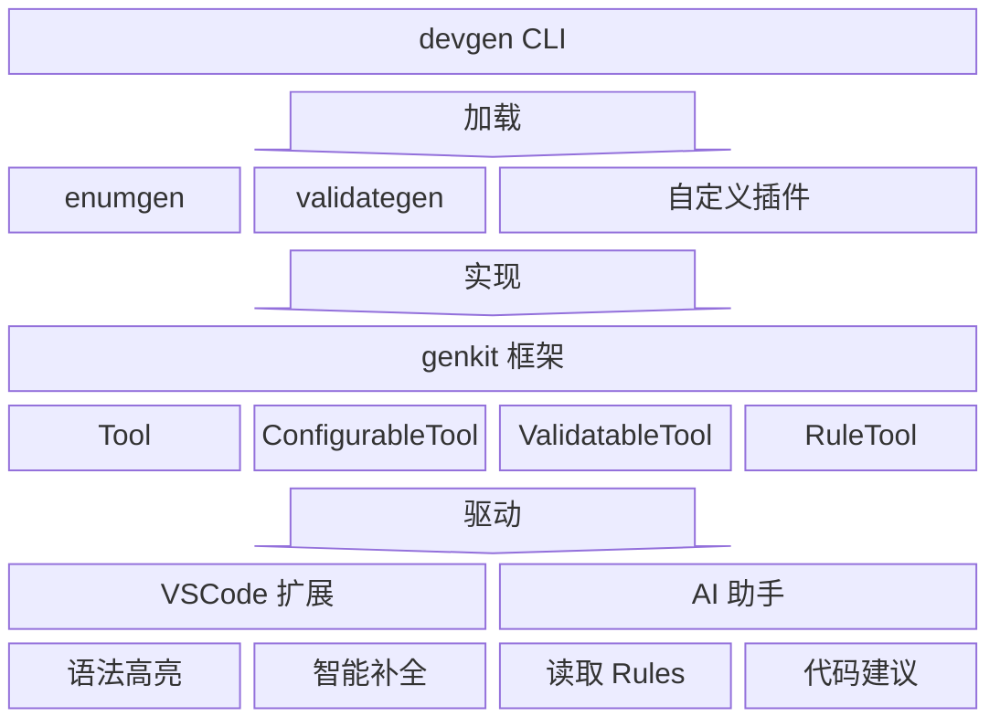

<div align="center">

# devgen

**Go 代码生成工具集，专为现代开发工作流设计**

[](https://go.dev/)
[](https://marketplace.visualstudio.com/items?itemName=tlipoca9.devgen)
[](LICENSE)

中文 | [English](README_EN.md)

</div>

---

## 为什么选择 devgen？

| 特性 | 描述 |
|------|------|
| 🤖 **AI 原生** | 内置 AI Rules 系统，让 AI 编程助手（CodeBuddy、Cursor、Kiro）理解你的代码生成规则 |
| 🧩 **插件架构** | 基于 genkit 框架的插件系统，轻松开发自定义代码生成器 |
| 💡 **智能 IDE** | VSCode 扩展提供语法高亮、智能补全、实时诊断，注解错误即时反馈 |
| ⚡ **零配置** | 插件自描述注解元数据，IDE 自动识别，即插即用 |
| 🔧 **开箱即用** | 内置 enumgen、validategen，覆盖最常见的代码生成场景 |

---

## 快速开始

### 安装

```bash
# 安装 devgen（包含所有工具）
go install github.com/tlipoca9/devgen/cmd/devgen@latest

# 或单独安装
go install github.com/tlipoca9/devgen/cmd/enumgen@latest
go install github.com/tlipoca9/devgen/cmd/validategen@latest
```

### 使用

```bash
devgen ./...                    # 运行所有生成器
devgen --include-tests ./...    # 同时生成测试文件
devgen --dry-run ./...          # 验证注解（不写入文件）
enumgen ./...                   # 仅运行枚举生成器
validategen ./...               # 仅运行验证生成器
```

---

## 核心特性



### 🤖 AI 原生集成

devgen 是首个内置 AI Rules 系统的 Go 代码生成工具。通过 `RuleTool` 接口，你的代码生成器可以自动生成 AI 编程助手能理解的文档。

#### 支持的 AI 助手

| 助手 | 输出目录 | 文件扩展名 | 格式 |
|------|---------|-----------|------|
| **Kiro** | `.kiro/steering/` | `.md` | YAML frontmatter，包含 `inclusion` 和 `fileMatchPattern` |
| **CodeBuddy** | `.codebuddy/rules/` | `.mdc` | YAML frontmatter，包含 `description`、`globs`、`alwaysApply` |
| **Cursor** | `.cursor/rules/` | `.mdc` | YAML frontmatter，包含 `description`、`globs`、`alwaysApply` |

#### AI Rules 快速开始

**列出可用的 AI 助手：**
```bash
devgen rules --list-agents
```

**预览规则（不写入文件）：**
```bash
devgen rules --agent kiro
```

**为你的 AI 助手生成规则：**
```bash
# 为 Kiro 生成
devgen rules --agent kiro -w

# 为 CodeBuddy 生成
devgen rules --agent codebuddy -w

# 为 Cursor 生成
devgen rules --agent cursor -w
```

#### AI Rules 提供的能力

生成的 rules 文件让 AI 助手能够：
- ✅ 理解你的注解语法和参数
- ✅ 提供准确的代码补全建议
- ✅ 在你编写代码时给出正确的使用示例
- ✅ 建议正确的错误处理模式
- ✅ 展示完整的工作示例

#### 示例：生成的 Kiro 规则

```markdown
---
inclusion: fileMatch
fileMatchPattern: ['**/*.go']
---

# enumgen - Go 枚举代码生成器

## 何时使用 enumgen？

在以下场景使用 enumgen：
- 为枚举类型生成 String() 方法
- 添加 JSON/SQL 序列化支持
- 实现验证方法

## 快速开始

### 步骤 1：定义枚举类型
\`\`\`go
// Status 表示订单状态
// enumgen:@enum(string, json)
type Status int

const (
    StatusPending Status = iota + 1
    StatusActive
)
\`\`\`

### 步骤 2：运行生成
\`\`\`bash
devgen ./...
\`\`\`
...
```

详见 [AI Rules 系统文档](cmd/devgen/rules/devgen-rules.md)。

---

### 🧩 插件系统

基于 **genkit** 框架的插件架构，让你轻松开发自定义代码生成器：

```go
// 只需实现 Tool 接口
type MyGenerator struct{}

func (m *MyGenerator) Name() string { return "mygen" }

func (m *MyGenerator) Run(gen *genkit.Generator, log *genkit.Logger) error {
    for _, pkg := range gen.Packages {
        for _, typ := range pkg.Types {
            if genkit.HasAnnotation(typ.Doc, "mygen", "gen") {
                // 生成代码...
            }
        }
    }
    return nil
}

var Tool genkit.Tool = &MyGenerator{}
```

**两种插件模式**：
| 类型 | 说明 | 适用场景 |
|------|------|----------|
| `source` | Go 源码，运行时编译 | 开发调试、快速迭代 |
| `plugin` | 预编译 .so 文件 | 高性能、生产环境 |

详见 [插件开发文档](docs/plugin.md)

---

### 💡 智能 IDE 支持

VSCode 扩展提供完整的开发体验：

- **语法高亮** - 注解关键字、参数值醒目显示
- **智能补全** - 输入 `@` 自动提示可用注解（基于 `ConfigurableTool`）
- **实时诊断** - 注解错误、参数校验即时反馈（基于 `ValidatableTool`）
- **插件感知** - 自动识别自定义插件的注解配置

[](https://marketplace.visualstudio.com/items?itemName=tlipoca9.devgen)

在 VSCode 扩展商店搜索 `devgen` 或点击上方徽章安装。

---

### ⚡ 可扩展接口

插件通过实现不同接口获得对应能力：

| 接口 | 能力 | 说明 |
|------|------|------|
| `Tool` | 代码生成 | 必须实现，核心生成逻辑 |
| `ConfigurableTool` | 智能补全 | 自描述注解元数据，IDE 自动识别 |
| `ValidatableTool` | 实时诊断 | 返回诊断信息，IDE 即时反馈错误 |
| `RuleTool` | AI Rules | 生成 AI 助手能理解的文档 |

示例 - 实现 `ConfigurableTool`：

```go
func (m *MyGenerator) Config() genkit.ToolConfig {
    return genkit.ToolConfig{
        OutputSuffix: "_gen.go",
        Annotations: []genkit.AnnotationConfig{
            {Name: "gen", Type: "type", Doc: "Generate code"},
        },
    }
}
```

VSCode 扩展通过 `devgen config --json` 获取注解元数据，提供智能补全。

示例 - 实现 `ValidatableTool`：

```go
func (m *MyGenerator) Validate(gen *genkit.Generator, log *genkit.Logger) []genkit.Diagnostic {
    var diags []genkit.Diagnostic
    for _, pkg := range gen.Packages {
        for _, typ := range pkg.Types {
            if err := validateAnnotation(typ); err != nil {
                diags = append(diags, genkit.Diagnostic{
                    Pos:      typ.Pos,
                    End:      typ.End,
                    Severity: genkit.SeverityError,
                    Message:  err.Error(),
                })
            }
        }
    }
    return diags
}
```

VSCode 扩展通过 `devgen --dry-run --json` 获取诊断信息，实时显示注解错误。

示例 - 实现 `RuleTool`：

```go
func (m *MyGenerator) Rules() []genkit.Rule {
    return []genkit.Rule{
        {
            Name:        "mygen",
            Description: "MyGenerator 使用指南",
            Content:     "# MyGenerator\n\n使用 `@gen` 注解标记类型...",
        },
    }
}
```

通过 `devgen rules --agent codebuddy -w` 生成 AI Rules 文件，让 AI 助手理解你的注解语法。

> VSCode 扩展激活时会自动检测 AI IDE（Cursor、Kiro、CodeBuddy），并自动运行此命令生成规则文件。

---

## 内置工具

### enumgen - 枚举生成器

为 Go 枚举类型生成序列化、反序列化和验证方法。

```go
// Status 表示状态
// enumgen:@enum(string, json, sql)
type Status int

const (
    StatusPending Status = iota + 1
    StatusActive
    StatusCanceled
)
```

**生成**：`String()` `MarshalJSON()` `UnmarshalJSON()` `Value()` `Scan()` `IsValid()` 等方法

详见 [enumgen 文档](cmd/enumgen/README.md)

---

### validategen - 验证生成器

为 Go 结构体生成 `Validate()` 方法。

```go
// User 用户模型
// validategen:@validate
type User struct {
    // validategen:@required
    // validategen:@email
    Email string

    // validategen:@gte(0) @lte(150)
    Age int
}
```

**支持**：`@required` `@email` `@url` `@min` `@max` `@oneof` `@regex` 等 20+ 验证规则

详见 [validategen 文档](cmd/validategen/README.md)

---

## 构建

```bash
make build    # 构建所有工具
make test     # 运行测试
make install  # 安装到 $GOPATH/bin
make vscode   # 构建 VSCode 扩展
```

## 更新日志

<details>
<summary>点击展开</summary>

- [v0.3.2](docs/release/v0.3.2.md) - 2025-12-09
- [v0.3.1](docs/release/v0.3.1.md) - 2025-12-08
- [v0.3.0](docs/release/v0.3.0.md) - 2025-12-08
- [v0.2.3](docs/release/v0.2.3.md) - 2025-12-08
- [v0.2.2](docs/release/v0.2.2.md) - 2025-12-08
- [v0.2.1](docs/release/v0.2.1.md) - 2025-12-07
- [v0.2.0](docs/release/v0.2.0.md) - 2025-12-07
- [v0.1.3](docs/release/v0.1.3.md) - 2025-12-07
- [v0.1.2](docs/release/v0.1.2.md) - 2025-12-07
- [v0.1.1](docs/release/v0.1.1.md) - 2025-12-07
- [v0.1.0](docs/release/v0.1.0.md) - 2025-12-07

</details>

## 许可证

MIT
