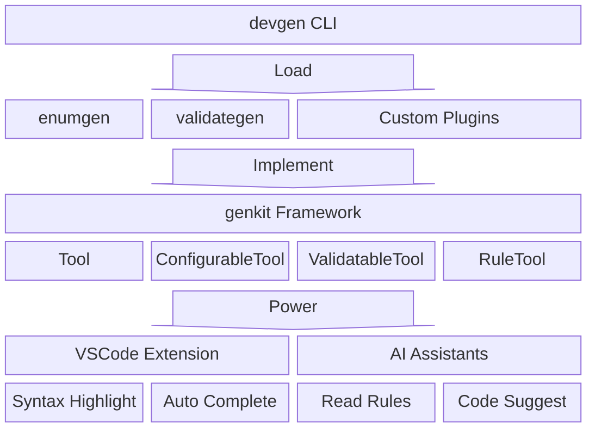

<div align="center">

# devgen

**Go Code Generation Toolkit, Designed for Modern Development Workflows**

[](https://go.dev/)
[](https://marketplace.visualstudio.com/items?itemName=tlipoca9.devgen)
[](LICENSE)

[中文](README.md) | English

</div>

---

## Why devgen?

| Feature | Description |
|---------|-------------|
| 🤖 **AI Native** | Built-in AI Rules system lets AI assistants (CodeBuddy, Cursor, Copilot) understand your code generation rules |
| 🧩 **Plugin Architecture** | genkit-based plugin system for easily developing custom code generators |
| 💡 **Smart IDE** | VSCode extension with syntax highlighting, auto-completion, real-time diagnostics |
| ⚡ **Zero Config** | Plugins self-describe annotation metadata, IDE auto-discovers, plug-and-play |
| 🔧 **Batteries Included** | Built-in enumgen & validategen cover most common code generation scenarios |

---

## Quick Start

### Installation

```bash
# Install devgen (includes all tools)
go install github.com/tlipoca9/devgen/cmd/devgen@latest

# Or install individually
go install github.com/tlipoca9/devgen/cmd/enumgen@latest
go install github.com/tlipoca9/devgen/cmd/validategen@latest
```

### Usage

```bash
devgen ./...                    # Run all generators
devgen --include-tests ./...    # Also generate test files
devgen --dry-run ./...          # Validate annotations (no file writes)
enumgen ./...                   # Run enum generator only
validategen ./...               # Run validation generator only
```

---

## Core Features



### 🤖 AI Native Integration

devgen is the first Go code generation tool with a built-in AI Rules system. Through the `RuleTool` interface, your generators can automatically produce documentation that AI assistants understand.

```bash
# Generate AI Rules for CodeBuddy/Cursor
devgen rules --agent codebuddy -w
```

Generated rules enable AI assistants to:
- Understand your annotation syntax and parameters
- Provide accurate code completion suggestions
- Give correct usage examples while you code

Supported AI assistants: CodeBuddy, Cursor, GitHub Copilot, Windsurf

---

### 🧩 Plugin System

The **genkit** framework-based plugin architecture makes developing custom generators easy:

```go
// Just implement the Tool interface
type MyGenerator struct{}

func (m *MyGenerator) Name() string { return "mygen" }

func (m *MyGenerator) Run(gen *genkit.Generator, log *genkit.Logger) error {
    for _, pkg := range gen.Packages {
        for _, typ := range pkg.Types {
            if genkit.HasAnnotation(typ.Doc, "mygen", "gen") {
                // Generate code...
            }
        }
    }
    return nil
}

var Tool genkit.Tool = &MyGenerator{}
```

**Two Plugin Modes**:
| Type | Description | Use Case |
|------|-------------|----------|
| `source` | Go source, compiled at runtime | Development, rapid iteration |
| `plugin` | Pre-compiled .so file | High performance, production |

See [Plugin Development Guide](docs/plugin_EN.md)

---

### 💡 Smart IDE Support

VSCode extension provides a complete development experience:

- **Syntax Highlighting** - Annotation keywords and parameter values stand out
- **Smart Completion** - Type `@` to see available annotations (via `ConfigurableTool`)
- **Real-time Diagnostics** - Instant feedback on annotation errors (via `ValidatableTool`)
- **Plugin Aware** - Auto-discovers custom plugin annotation configurations

[](https://marketplace.visualstudio.com/items?itemName=tlipoca9.devgen)

Search `devgen` in VSCode Extensions or click the badge above to install.

---

### ⚡ Extensible Interfaces

Plugins gain capabilities by implementing different interfaces:

| Interface | Capability | Description |
|-----------|------------|-------------|
| `Tool` | Code Generation | Required, core generation logic |
| `ConfigurableTool` | Smart Completion | Self-describe annotation metadata, IDE auto-discovers |
| `ValidatableTool` | Real-time Diagnostics | Return diagnostics, IDE shows errors instantly |
| `RuleTool` | AI Rules | Generate docs that AI assistants understand |

Example - implementing `ConfigurableTool`:

```go
func (m *MyGenerator) Config() genkit.ToolConfig {
    return genkit.ToolConfig{
        OutputSuffix: "_gen.go",
        Annotations: []genkit.AnnotationConfig{
            {Name: "gen", Type: "type", Doc: "Generate code"},
        },
    }
}
```

VSCode extension fetches annotation metadata via `devgen config --json` to provide smart completion.

Example - implementing `ValidatableTool`:

```go
func (m *MyGenerator) Validate(gen *genkit.Generator, log *genkit.Logger) []genkit.Diagnostic {
    var diags []genkit.Diagnostic
    for _, pkg := range gen.Packages {
        for _, typ := range pkg.Types {
            if err := validateAnnotation(typ); err != nil {
                diags = append(diags, genkit.Diagnostic{
                    Pos:      typ.Pos,
                    End:      typ.End,
                    Severity: genkit.SeverityError,
                    Message:  err.Error(),
                })
            }
        }
    }
    return diags
}
```

VSCode extension fetches diagnostics via `devgen --dry-run --json` to show annotation errors in real-time.

Example - implementing `RuleTool`:

```go
func (m *MyGenerator) Rules() []genkit.Rule {
    return []genkit.Rule{
        {
            Name:        "mygen",
            Description: "MyGenerator usage guide",
            Content:     "# MyGenerator\n\nUse `@gen` annotation to mark types...",
        },
    }
}
```

Run `devgen rules --agent codebuddy -w` to generate AI Rules files, helping AI assistants understand your annotation syntax.

> VSCode extension auto-detects AI IDEs (Cursor, Windsurf, CodeBuddy) on activation and automatically runs this command to generate rules.

---

## Built-in Tools

### enumgen - Enum Generator

Generates serialization, deserialization, and validation methods for Go enum types.

```go
// Status represents status
// enumgen:@enum(string, json, sql)
type Status int

const (
    StatusPending Status = iota + 1
    StatusActive
    StatusCanceled
)
```

**Generates**: `String()` `MarshalJSON()` `UnmarshalJSON()` `Value()` `Scan()` `IsValid()` and more

See [enumgen docs](cmd/enumgen/README_EN.md)

---

### validategen - Validation Generator

Generates `Validate()` methods for Go structs.

```go
// User model
// validategen:@validate
type User struct {
    // validategen:@required
    // validategen:@email
    Email string

    // validategen:@gte(0) @lte(150)
    Age int
}
```

**Supports**: `@required` `@email` `@url` `@min` `@max` `@oneof` `@regex` and 20+ validation rules

See [validategen docs](cmd/validategen/README_EN.md)

---

## Build

```bash
make build    # Build all tools
make test     # Run tests
make install  # Install to $GOPATH/bin
make vscode   # Build VSCode extension
```

## Changelog

<details>
<summary>Click to expand</summary>

- [v0.3.2](docs/release/v0.3.2_EN.md) - 2025-12-09
- [v0.3.1](docs/release/v0.3.1_EN.md) - 2025-12-08
- [v0.3.0](docs/release/v0.3.0_EN.md) - 2025-12-08
- [v0.2.3](docs/release/v0.2.3_EN.md) - 2025-12-08
- [v0.2.2](docs/release/v0.2.2_EN.md) - 2025-12-08
- [v0.2.1](docs/release/v0.2.1_EN.md) - 2025-12-07
- [v0.2.0](docs/release/v0.2.0_EN.md) - 2025-12-07
- [v0.1.3](docs/release/v0.1.3_EN.md) - 2025-12-07
- [v0.1.2](docs/release/v0.1.2_EN.md) - 2025-12-07
- [v0.1.1](docs/release/v0.1.1_EN.md) - 2025-12-07
- [v0.1.0](docs/release/v0.1.0_EN.md) - 2025-12-07

</details>

## License

MIT
